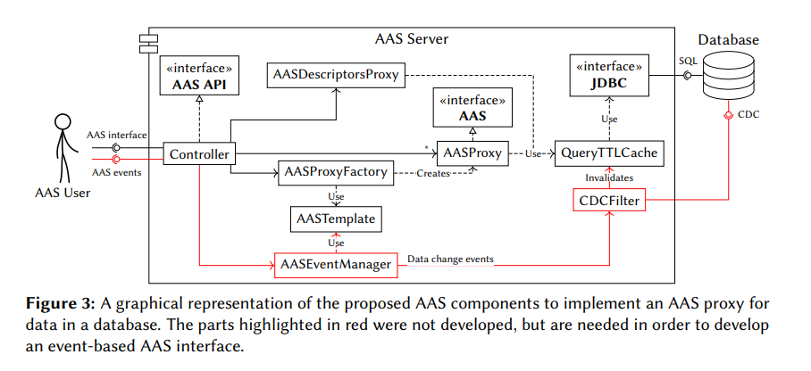
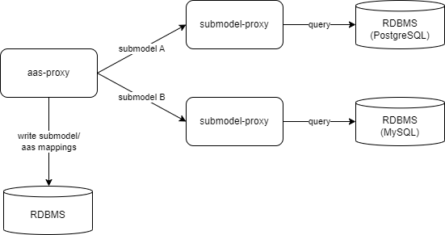

  <div align="center">
  <h1>go-aas-proxy</h1>
  <p>
  Asset Administration Shell(AAS) proxy for RDBMS backend
  </p>

  [](https://github.com/hiroyoshii/go-aas-proxy/actions/workflows/go_application.yml)
  [](https://github.com/hiroyoshii/go-aas-proxy/actions/workflows/codeql.yml)
  [](https://securityscorecards.dev/viewer/?uri=github.com/hiroyoshii/go-aas-proxy)
  [](https://goreportcard.com/report/github.com/hiroyoshii/go-aas-proxy)
  [](https://www.bestpractices.dev/projects/7795)
  
  [](LICENSE)

  </div>


  ## About

  The go-aas-proxy is asset administration shell(aas) server which is implemented by go and proxy to RDBMS backend. **not ready for production**.

  This implementation is inspired from "aas-proxy" in [Representing the Virtual: Using AAS to Expose DigitalAssets](https://ceur-ws.org/Vol-3291/paper5.pdf) paper.
  

  "aas-proxy" means that submodels are configured by referencing the RDB of other applications.
  Therefore, only the AAS and the AAS-Submodel relationship can be created, updated, or deleted, while submodels are read-only.

  ## Features
  - Open API Endpoints compatible with [Basyx API](https://app.swaggerhub.com/apis/BaSyx/basyx_asset_administration_shell_http_rest_api/v1). But only supports following endpoints:
    - :white_check_mark: /shells: GET
    - :white_check_mark: /shells/{aasId}: GET/PUT/DELETE
    - :white_check_mark: /shells/{aasId}/aas/submodels: GET
    - :white_check_mark: /shells/{aasId}/aas/submodels/{submodelIdShort}: GET
    - :white_check_mark: /shells/{aasId}/aas/submodels/{submodelIdShort}/submodel/submodelElements: GET
    - :white_check_mark: /shells/{aasId}/aas/submodels/{submodelIdShort}/submodel/values: GET
    - :warning:	 /shells/{aasId}/aas/submodels/{submodelIdShort}: PUT(only relation to aas)
  - Support multiple RDBMS locations and types (Postgres, MySQL, Oracle)

  Unsuported:
  - :x: create/update/delete submodels and submodel elements
  - :x: Endpoints containing \{seIdShortPath\}
  - :x: Invocation Endpoints

  ## Implementation Overview
  
  - configurablity for submodel
    - reference databases per semanticID of submodel
    - query for databases
    - response json content for submodels

  ## How to run
  1. screate following submodel configuration file.
    - there are multiple reference database and query templates.
    - SQL query template has requested path parameter variables: .AasID, .SubmodelIDShort.
    - response template has query results variables: `.<template file name>.Results.<column name>` and `.<template file name>.Columns.<column name>`.
      - for example, template file path is sample/query.sql and column name is sample, variables are `.Query.Results.Sample` and `.Query.Columns.Sample`
  ```yaml
  submodels:
    - semanticID: "<submodel semantic ID>"
      queryTemplates:
        - path: "<SQL query file path (go template)>"
          dbName: "<database name for query execution>"
      responseTemplatePath: "<submodel json template file path>"
  databases:
    - name: "<database name referenced by submodels.queryTemplates.dbName>"
      dbType: <type of RDBMS: postgres, mysql or oracle>
      dbConfig:
        host: <database host>
        port: <database port number>
        user: "<database user>"
        password: "<database password>"
        database: "<database name>"
        sslmode: "<sslmode if dbType is postgres>"
        options: "<database connection options>"
  ```
  2. set up postgresql database for aas and asset
  3. docker run
  ```
  docker run \
  -e SUBMODEL_CONFIG_PATH=<configuration file path in procedure 1.> \
  -e AAS_TABLES_CREATED=true \
  -e AAS_DB_HOST=<database host name in procedure 2.> \
  hiroyoshii/go-aas-proxy:latest
  ```

  ### Example
  * run with sample data (run docker-compose and create sample deta)
  ```
  ./e2e/scenario_setup.sh
  ```
  * Submodel configurations can be found in the ./e2e/application/configs directory.

  ### Environment Variables
  | variables            | overview                                                              | sample               | required                | 
  | -------------------- | --------------------------------------------------------------------- | -------------------- | ----------------------- | 
  | SUBMODEL_CONFIG_PATH | submodel configuration file path.<br>                                 | submodel_config.yaml | yes                     | 
  | AAS_TABLES_CREATED   | DDL stored AAS data is created or not when go-aas-proxy is started.   | true                 | no (default: true)      | 
  | AAS_DB_HOST          | Postgresql database host name for AAS stored                          | 127.0.0.1            | no (default: 127.0.0.1) | 
  | AAS_DB_PORT          | Postgresql database port number for AAS stored                        | 5432                 | no (default: 5432)      | 
  | AAS_DB_USER          | Postgresql database user for AAS stored                               | postgres             | no (default: postgres)  | 
  | AAS_DB_PASSWORD      | Postgresql database password for AAS stored                           | password             | no (default: password)  | 
  | AAS_DB_DATABASE      | Postgresql database name for AAS stored                               | sample               | no (default: sample)    | 
  | AAS_DB_SSL_MODE      | Postgresql database sslmode for AAS stored                            | disable              | no (default: disable)   | 

  ## License
  Apache License 2.0, see [LICENSE](./LICENSE).
