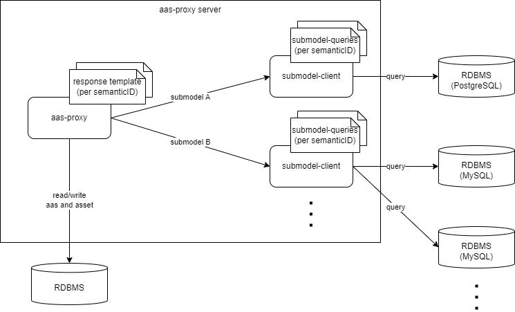

<h1>go AAS proxy</h1>

Asset Administration Shell(AAS) to RDBMS backend proxy

## About

The go-aas-proxy is asset administration shell(aas) server which is implemented by go and proxy to RDBMS backend. **not for production ready**.

This implementation is inspired from "aas-proxy" in [Representing the Virtual: Using AAS to Expose DigitalAssets](https://ceur-ws.org/Vol-3291/paper5.pdf) paper.

features:
- Open API Endpoints compatible with [Basyx API](https://app.swaggerhub.com/apis/BaSyx/basyx_asset_administration_shell_http_rest_api/v1). But only supports following Endpoints
  - GET
    - ⭕ /shells
- Support multiple RDBMS(Postgres, MySQL, Oracle)

# Architecture

# How to run

## Configs

## Environments

# License
